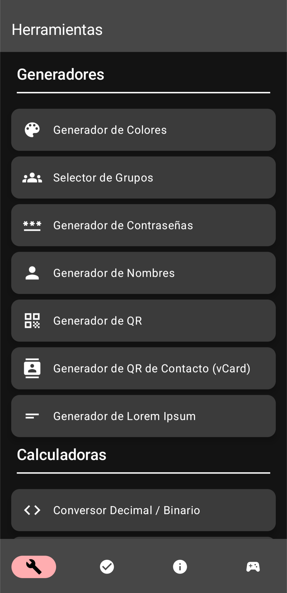
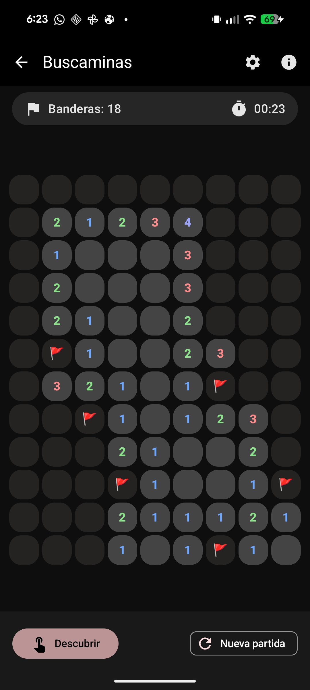
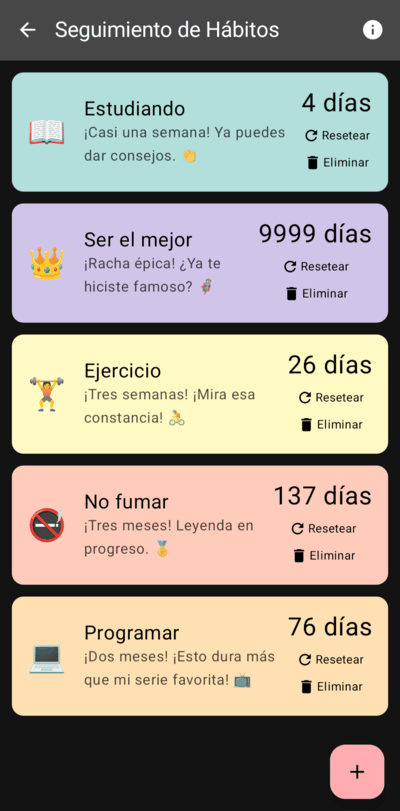
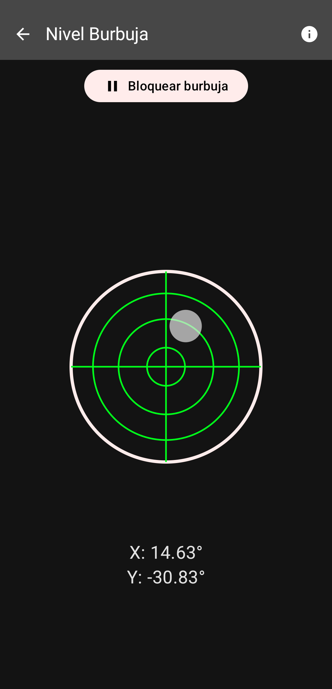

# MiniToolbox 🛠️
> **La navaja suiza digital definitiva para Android.**
> *Arquitectura moderna, alto rendimiento y telemetría avanzada.*

MiniToolbox es una aplicación de utilidades todo-en-uno desarrollada con un enfoque nativo en **Kotlin** y **Jetpack Compose**. El proyecto nació como un reto de ingeniería para optimizar herramientas cotidianas, logrando una integración fluida con sensores de hardware, realidad aumentada y un sistema de persistencia de datos ultra eficiente.

---

## 🚀 Logros de Ingeniería (The "Power Moves")

### 1. Optimización de Performance: Del JSON al Binario
Para la gestión de datasets (como la base de datos de países), se realizó un análisis exhaustivo comparando diferentes formatos de serialización para minimizar el impacto en la experiencia de usuario.

| Formato | Tamaño Archivo | Tiempo Total (Carga + Parseo) |
| :--- | :--- | :--- |
| **API REST (Online)** | - | ~3000 ms |
| **JSON + Moshi** | 132 KB | ~451 ms |
| **JSON + Gson** | 132 KB | ~75 ms |
| **Protobuf Lite (Binario)** | **26 KB** | **~45 ms** |

**Resultado:** Gracias a la migración a **Protobuf Lite**, se logró una reducción del **80% en el tamaño del archivo** y una velocidad de carga **98.5% superior** en comparación con consultas externas. Esto garantiza que la herramienta sea instantánea incluso en dispositivos de gama baja, ademas de ofrecer acceso a los datos sin conexión a internet.

### 2. Business Intelligence & Telemetría Propia
Diseñé un motor de telemetría personalizado para monitorear el ciclo de vida del producto sin depender exclusivamente de soluciones genéricas:
- **Stack:** Firebase Cloud Functions (TypeScript) + Firestore + Web Dashboard.
- **Métricas:** Adopción de versiones, retención, frecuencia de uso por herramienta e idiomas predominantes.
- **Impacto:** Decisiones basadas en datos reales para priorizar el desarrollo de las funcionalidades más utilizadas.

### 3. Integración de Hardware y Sensores Avanzados
- **AR Ruler:** Implementación de **ARCore** y **SceneView** para mediciones de precisión en espacios 3D.
- **Foreground Services:** Gestión de hilos persistentes para el temporizador Pomodoro, garantizando estabilidad total.
- **Widgets (Glance):** Micro-interfaces reactivas para la pantalla de inicio desarrolladas con el nuevo framework de Google.

---

## ✨ Herramientas Destacadas

| Feature | Tecnología | Descripción |
| :--- | :--- | :--- |
| **Regla AR** | ARCore / SceneView | Medición de distancias mediante visión por computadora. |
| **Pomodoro Pro** | Foreground Services | Sistema de productividad con persistencia de estado. |
| **Divisor de Gastos** | State Management | Lógica compleja para gestión de finanzas grupales. |
| **Buscaminas** | Compose Canvas | Implementación de lógica de juego reactiva. |
| **Brújula y Nivel** | SensorManager | Uso de Magnetómetro y Acelerómetro del dispositivo. |

---

## 🏗️ Arquitectura del Software

El proyecto sigue el patrón **MVVM (Model-View-ViewModel)** bajo principios de **Clean Architecture**:

- **Data Layer:** Gestión de preferencias con `DataStore` y datasets binarios con ProtoBuf.
- **Domain Layer:** Lógica de negocio desacoplada (cálculos financieros, conversores, motores de juegos).
- **UI Layer:** Interfaces declarativas con Jetpack Compose, utilizando un sistema de temas personalizado (Material 3).

### Estructura del Repositorio
- `/app`: Código fuente Android (Kotlin).
- `/backend`: Firebase Functions (TypeScript) para la API de métricas.
- `/dashboard`: Panel de control web (JS/CSS) para visualización de datos.
- `/docs`: Análisis detallados de performance y documentación de arquitectura.

---

## 🛠️ Stack Tecnológico
- **UI:** Jetpack Compose, Material 3, Glance (Widgets).
- **Asincronía:** Kotlin Coroutines & Flow.
- **Persistencia:** Jetpack DataStore, Protobuf.
- **Cloud:** Firebase (Auth, Firestore, Functions, Cloud Messaging).
- **Monetización:** Google Play Billing Library & AdMob.
- **Análisis:** Custom Telemetry System + Firebase Analytics.

---

## 📈 Impacto Real
- **Rating:** 4.9/5 ⭐ en Google Play Store.
- **Instalaciones:** +130 descargas orgánicas.
- **Comunidad:** Feedback activo de usuarios con 19 reseñas positivas.

---

## 📸 Screenshots
<table>
  <tr>
    <td></td>
    <td></td>
    <td></td>
    <td></td>
  </tr>
</table>

---

## 🤝 Contacto
Este es mi proyecto más ambicioso y estoy abierto a discutir detalles técnicos sobre la implementación de ProtoBuf, ARCore o la arquitectura del dashboard.

- **LinkedIn:** [Joaquin Sasso](https://www.linkedin.com/in/joasasso/)
- **Play Store:** [Descarga MiniToolbox](https://play.google.com/store/apps/details?id=com.joasasso.minitoolbox)

---
*Desarrollado con ❤️ por Joaquín Sasso.*