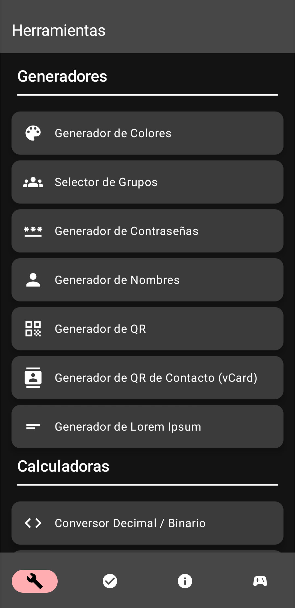
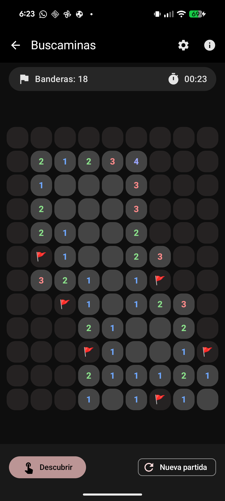
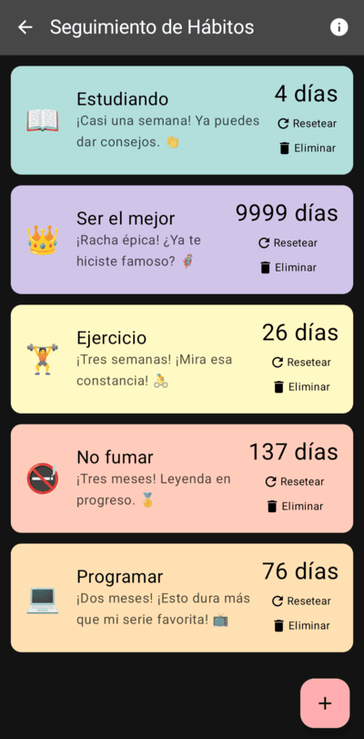
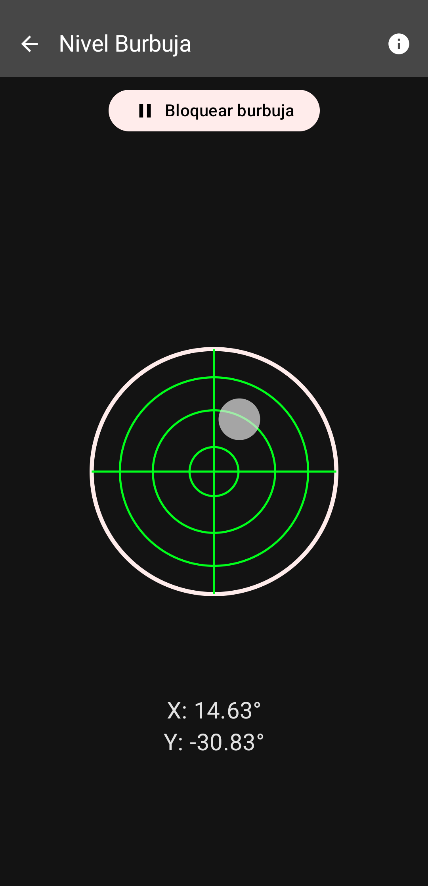

# MiniToolbox 🛠️
> **Colección de herramientas de utilidad nativas para Android.**
> *Arquitectura moderna, alto rendimiento y telemetría avanzada.*

MiniToolbox es una aplicación de utilidades todo-en-uno desarrollada con un enfoque nativo en **Kotlin** y **Jetpack Compose**. El proyecto nació como un reto de ingeniería para optimizar herramientas cotidianas, logrando una integración fluida con sensores de hardware, realidad aumentada y un sistema de persistencia de datos ultra eficiente.

---

## 🚀 Desafíos Técnicos y Soluciones

### 1. Optimización de Performance: Del JSON al Binario
Para la gestión de datasets (como la base de datos de países), se realizó un análisis exhaustivo comparando diferentes formatos de serialización para minimizar el impacto en la experiencia de usuario.

| Formato | Tamaño Archivo | Tiempo Total (Carga + Parseo) |
| :--- | :--- | :--- |
| **API REST (Online)** | - | ~3000 ms |
| **JSON + Moshi** | 132 KB | ~451 ms |
| **JSON + Gson** | 132 KB | ~75 ms |
| **Protobuf (Binario)** | **26 KB** | **~45 ms** |

**Resultado:** Gracias a la migración a **Protobuf (Binario)**, se logró una reducción del **80% en el tamaño del archivo** y una velocidad de carga **98.5% superior** en comparación con consultas externas. Esto garantiza que la herramienta sea instantánea incluso en dispositivos de gama baja, ademas de ofrecer acceso a los datos sin conexión a internet. *Nota: Actualmente se utiliza la variante completa de Protobuf Java para asegurar compatibilidad total, lo cual incrementa el tamaño del APK en comparación con la variante Lite.*

### 2. Business Intelligence & Telemetría Propia
Diseñé un motor de telemetría personalizado para monitorear el ciclo de vida del producto sin depender exclusivamente de soluciones genéricas:
- **Stack (Backend):** Firebase Cloud Functions (TypeScript) + Firestore + Web Dashboard. La aplicación móvil se comunica mediante HTTPS estándar.
- **Métricas:** Adopción de versiones, retención, frecuencia de uso por herramienta e idiomas predominantes.
- **Impacto:** Decisiones basadas en datos reales para priorizar el desarrollo de las funcionalidades más utilizadas.

### 3. Integración de Hardware y Sensores Avanzados
- **AR Ruler:** Implementación de **ARCore** y **SceneView** para mediciones de precisión en espacios 3D.
- **Foreground Services:** Gestión de hilos persistentes para el temporizador Pomodoro, garantizando estabilidad total.
- **Widgets (Glance):** Micro-interfaces reactivas para la pantalla de inicio desarrolladas con el nuevo framework de Google.

### 4. Documentación de Debugging: Diagnóstico del Pomodoro en Android 17
El temporizador Pomodoro presentaba fallos en background que requerían debugging profundo a través de 6 problemas independientes apilados. En lugar de simplemente parchear, documenté el proceso completo:

- **Archivo:** [pomodoro-background-alarm-fix.md](docs/pomodoro-background-alarm-fix.md) (415 líneas de análisis técnico)
- **Contenido:** Diagnóstico de cada problema, causa raíz, solución implementada y metodología de prueba reutilizable
- **Herramientas usadas:** adb, dumpsys alarm, Logcat filtering, forced Doze simulation, Android 17 audio hardening flags
- **Impacto:** Documentación que sirve como referencia para otros desarrolladores enfrentando problemas similares con alarmas exactas, foreground services y audio en background

---

## ✨ Herramientas Destacadas

| Feature | Tecnología | Descripción |
| :--- | :--- | :--- |
| **Regla AR** | ARCore / SceneView | Medición de distancias mediante visión por computadora. |
| **Pomodoro Pro** | Foreground Services | Sistema de productividad con persistencia de estado. |
| **Divisor de Gastos** | State Management | Lógica compleja para gestión de finanzas grupales. |
| **Buscaminas** | Compose Canvas | Implementación de lógica de juego reactiva. |
| **Brújula y Nivel** | SensorManager | Uso de Magnetómetro y Acelerómetro del dispositivo. |

---

## 🏗️ Arquitectura del Software

El proyecto utiliza una arquitectura orientada a componentes con **Jetpack Compose** y **Compose Navigation**:

- **Persistencia:** Gestión de preferencias con `DataStore` y datasets binarios optimizados con Protobuf.
- **Lógica de Negocio:** Motores de juego (Buscaminas) y cálculos (Divisor de Gastos) integrados, con una migración progresiva hacia ViewModels para desacoplar el estado de la UI.
- **UI:** Interfaces 100% declarativas con Material 3 y soporte para Widgets nativos (Glance).

### Configuración local
Para habilitar la telemetría, configurá `local.properties` con:
- `METRICS_ENDPOINT`
- `METRICS_API_KEY`
Si faltan, la app funciona igual, pero no reporta métricas.

### Estructura del Repositorio
- `/app`: Código fuente Android (Kotlin).
- `/backend`: Firebase Functions (TypeScript) para la API de métricas.
- `/dashboard`: Panel de control web (JS/CSS) para visualización de datos.
- `/docs`: Análisis detallados de performance, documentación de arquitectura, implementación e investigación.

---

## 🛠️ Stack Tecnológico
- **UI:** Jetpack Compose, Material 3, Glance (Widgets).
- **Asincronía:** Kotlin Coroutines & Flow.
- **Persistencia:** Jetpack DataStore, Protobuf (Full Java).
- **Backend:** Firebase Functions & Firestore (procesamiento externo de métricas).
- **Monetización:** Google Play Billing Library & AdMob.
- **Análisis:** Custom Telemetry System (sin SDKs externos en la App).

---

## 📈 Impacto Real
- **Rating:** 5/5 ⭐ en Google Play Store, basado en 24 reseñas.
- **Instalaciones:** +400 usuarios únicos (según métricas internas).
- **Comunidad:** Feedback activo de usuarios con 19 reseñas positivas.

---

## 🛠️ Estado del Proyecto

Para mantener la transparencia técnica, el proyecto reconoce y documenta su estado actual:

- **Lo Sólido:**
    - Motor de juego del Buscaminas (Canvas) con lógica desacoplada.
    - Integración de sensores (Magnetómetro, Acelerómetro) y ARCore funcional.
    - Sistema de métricas ligero y respetuoso de la privacidad.
    - Documentación técnica detallada de problemas complejos (Post-mortems).

- **Deuda Técnica Conocida:**
    - **Modularización:** Actualmente es un módulo único (`:app`).
    - **Arquitectura:** Gran parte de las herramientas mantienen lógica de negocio y estado dentro de los Composables, en transición hacia ViewModels.
    - **Inyección de Dependencias:** Pendiente de implementar (Hilt o Koin).
    - **Cobertura de Tests:** Faltan tests de UI y unitarios fuera del núcleo del buscador de minas.

---

## 📸 Screenshots
<table>
  <tr>
    <td></td>
    <td></td>
    <td></td>
    <td></td>
  </tr>
</table>

---

## 🤝 Contribución
Este proyecto utiliza Integración Continua (GitHub Actions) para garantizar la calidad del código y la estabilidad del build.

**¿Por qué es importante el CI aquí?**
Este sistema se implementó después de detectar un bug crítico: el proyecto no compilaba desde un clon limpio porque dependía de archivos locales no versionados. El CI actúa como un "entorno limpio" que verifica que cualquier cambio pueda ser integrado y compilado por cualquier desarrollador desde cero.

Este es uno de mis proyectos personales más completos y estoy abierto a discutir detalles técnicos sobre la implementación de ProtoBuf, ARCore o la arquitectura del dashboard.

- **LinkedIn:** [Joaquin Sasso](https://www.linkedin.com/in/joasasso/)
- **Play Store:** [Descarga MiniToolbox](https://play.google.com/store/apps/details?id=com.joasasso.minitoolbox)

---
*Desarrollado con ❤️ por Joaquín Sasso.*