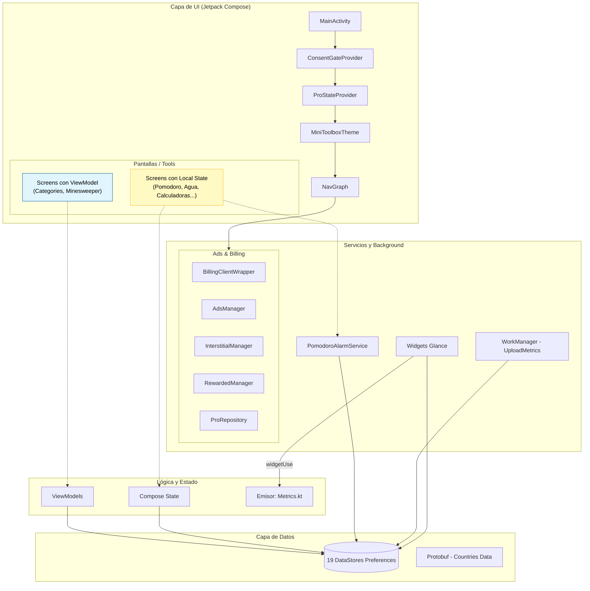
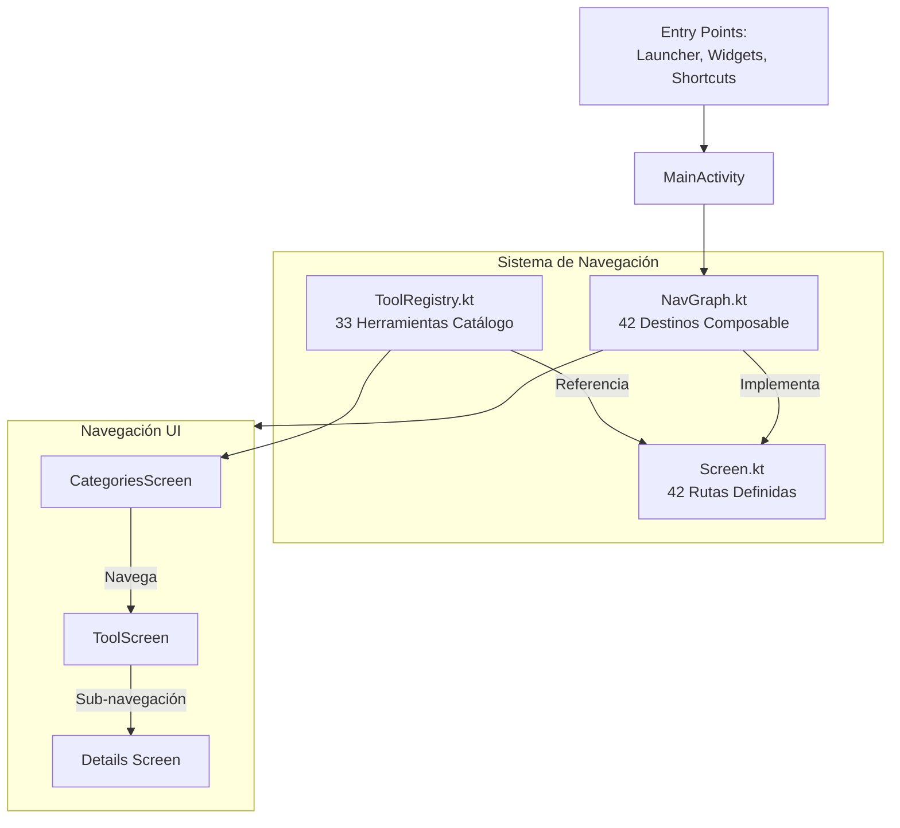
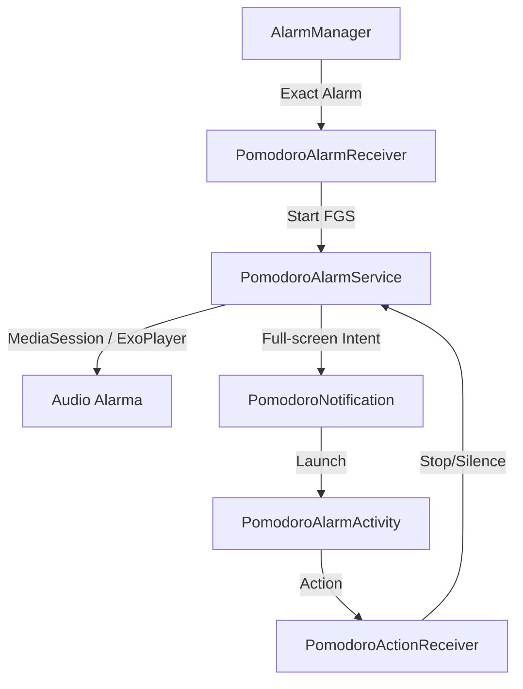

# Arquitectura de MiniToolbox

Este documento describe la arquitectura real del sistema MiniToolbox. Ha sido validado contra el código fuente para asegurar que representa la implementación existente, incluyendo sus asimetrías y limitaciones.

**Última verificación:** 23 de agosto de 2026
**Commit verificado:** `8dce4e21fd7adf88a632d93f206c18abdf368f3d`

---

## 1. Vista General de Componentes

La aplicación sigue un modelo de **módulo único** (`:app`) con una orquestación centralizada en `MainActivity` mediante capas de Composición.

### Diagrama A: Capas y Gestión de Estado

Este diagrama muestra cómo conviven las dos estrategias de estado en la app. Se destaca visualmente la asimetría entre pantallas con arquitectura formal (ViewModel) y pantallas con lógica embebida (Local State).



---

## 2. Subsistema de Telemetría (Privacidad por Diseño)

El pipeline de métricas es el componente más diferenciador del sistema. Está diseñado para recolectar datos de uso sin comprometer la privacidad del usuario: **no existen identificadores de dispositivo, ni de sesión, ni rastro de eventos individuales.**

### Diagrama B: Pipeline de Telemetría End-to-End

```mermaid
flowchart TD
    subgraph App [App Android]
        E["Emisor: Metrics.kt"] --> Gate{isMetricsEnabled?}
        Gate -- "No" --> End["Drop"]
        Gate -- "Yes" --> AR["AggregatesRepository"]
        AR -- "Delta Diario Local" --> MDS[(MetricsDataStore)]
        
        E -- "maybeSchedule" --> US["UploadScheduler"]
        US -- "WorkManager Enqueue" --> UM["UploadMetricsWorker"]
        UM -- "Lectura Payload" --> MDS
        UM -- "maybeSchedule (re-agenda)" -.-> US
    end

    subgraph Backend [Backend Google Cloud]
        UM -- "HTTPS POST JSON" --> CF_ingest["Cloud Function: ingest"]
        CF_ingest -- "Increment Counters" --> FS[(Firestore)]
        
        FS -- "Solo Lectura (Rule: Deny All)" --> CF_read["Cloud Functions: metricsDaily / Summary"]
    end

    subgraph Analytics [Dashboard]
        CF_read -- "X-API-Key" --> DB[Dashboard Web]
    end

    note[Firestore Rules niegan acceso directo.<br/>Todo acceso es vía Cloud Function.]
    style note fill:#f8bbd0,stroke:#c2185b,color:#000
```

---

## 3. Sistema de Navegación y Catálogo

El sistema de navegación desacopla la definición técnica de la ruta de la representación visual en el catálogo.

### Diagrama C: Flujo de Navegación



---

## 4. Subsistema de Alarma Pomodoro

Debido a las restricciones de Android sobre alarmas exactas y audio en background, este subsistema utiliza un `Foreground Service` orquestado.



---

## 5. Estructura de Paquetes Real

```
app/src/main/java/com/joasasso/minitoolbox/
├── data/               # Repositorios y DataStores globales (Pro, Favoritos, etc.)
├── metrics/            # Pipeline de telemetría (storage, uploader)
├── nav/                # Definiciones de Screen y rutas
├── tools/              # Lógica de herramientas dividida por categoría
│   ├── entretenimiento/
│   │   ├── minijuegos/ # Incluye 'minesweeper'
│   │   └── aleatorio/
│   ├── herramientas/
│   │   ├── calculadoras/
│   │   ├── generadores/
│   │   └── instrumentos/
│   ├── info/
│   └── organizacion/
│       ├── divisorGastos/
│       ├── pomodoro/
│       └── recordatorios/
├── ui/                 # Componentes comunes, temas y capas globales (Ads)
├── utils/              # Managers de Ads y Billing
├── viewmodel/          # ViewModels de pantallas principales
└── widgets/            # Implementaciones de Glance Widgets
```

---

## 6. Modelo de Persistencia

El sistema utiliza **19 instancias de `preferencesDataStore`**. 
- 16 están centralizadas en archivos dentro del paquete `data/`.
- 1 está en `metrics/storage/` (MetricsDataStore.kt), aislada a propósito por pertenecer al subsistema de telemetría.
- 2 están embebidas directamente en los archivos de Screen (`GuessCapitalScreen.kt` y `QuickMathScreen.kt`) por acoplamiento histórico.

**Nota sobre duplicidad:** Algunos archivos en `data/` declaran más de un DataStore (ej. `ExpensesDataStore.kt` y `PomodoroDataStore.kt`). Esto suele indicar una transición incompleta de esquemas o una separación de responsabilidades (estado vs. configuración) pendiente de unificar.

---

## 7. Limitaciones Conocidas de la Arquitectura Actual

1.  **Módulo Único**: Toda la aplicación reside en `:app`, lo que ralentiza tiempos de compilación y dificulta la encapsulación.
2.  **Estado en Composables**: ~90% de las herramientas gestionan su estado interno (`remember/mutableStateOf`) sin un ViewModel, dificultando el testing unitario de la lógica de negocio.
3.  **Ausencia de DI**: No se utiliza inyección de dependencias (Hilt/Koin); las dependencias se pasan manualmente o se acceden vía Singleton/Context.
4.  **Desincronización Taxonómica**: La ruta `"quotes"` está vinculada a `BasicPhrasesScreen`. Las métricas reportadas bajo este ID corresponden en realidad a la herramienta de frases, no a citas.
5.  **Shadowing de Protobuf**: `CategoriesScreen.kt` importa accidentalmente `com.google.protobuf.LazyStringArrayList.emptyList`, sombreando la función estándar de Kotlin.
6.  **DataStores Remanentes**: Existen instancias como `reuniones_gastos` (en `ExpensesDataStore.kt`) y `pomodoro_settings` (en `PomodoroDataStore.kt`) que son remanentes de migraciones o estructuras antiguas y no deberían usarse para nuevos desarrollos.

---

## 8. Nota de Método y Validación

Este documento se mantiene bajo un esquema de **validación estricta**. Cada caja y cada flecha de los diagramas debe ser verificable contra una línea de código específica. Cualquier discrepancia entre el código y el diagrama se considera un bug de documentación.

### Propuesta de Verificación Automática (Futuro)

Para evitar desincronizaciones en los números citados, se propone implementar un test de instrumentación o un script de CI que valide:
- Cantidad de `preferencesDataStore` (vía `grep`).
- Cantidad de rutas en `Screen.kt` (vía reflexión sobre `sealedSubclasses`).
- Cantidad de herramientas en `ToolRegistry.kt` (vía inspección de la lista `tools`).

De este modo, un cambio en el código que afecte estas métricas obligaría a actualizar la arquitectura o fallaría el build.
