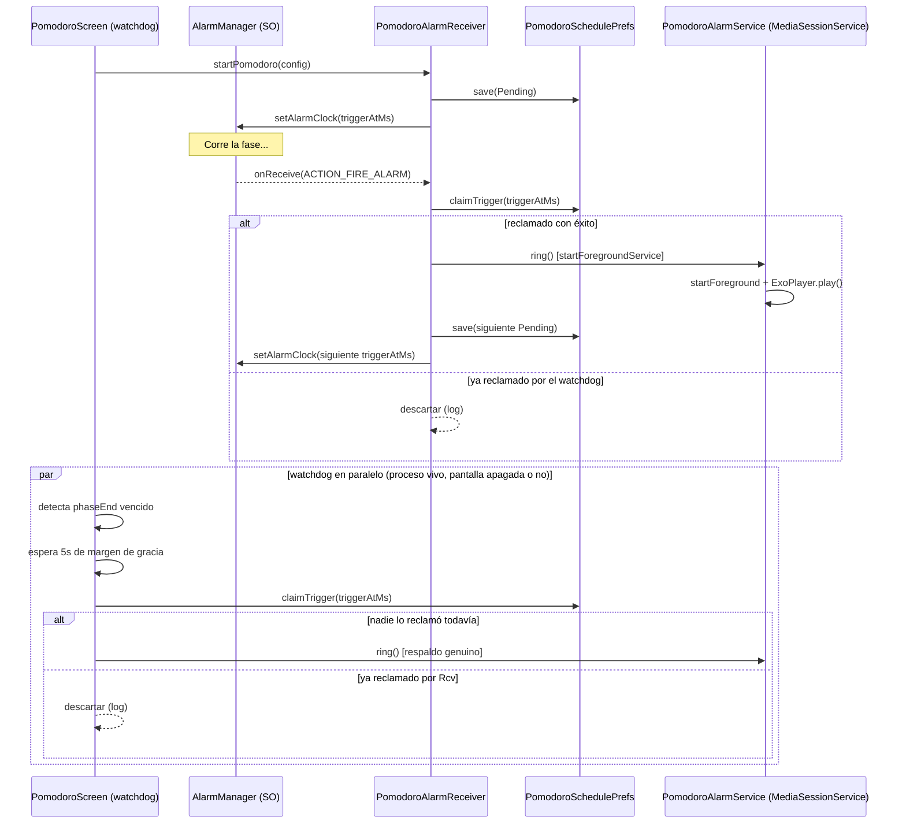

# Diagnóstico y arreglo del temporizador Pomodoro en segundo plano

**Fecha:** agosto de 2026
**Entorno de prueba:** Google Pixel 8, Android 17 ("CinnamonBun"), `targetSdk 37`
**Módulo:** `com.joasasso.minitoolbox.tools.organizacion.pomodoro`

## Resumen

El temporizador Pomodoro se comportaba de forma impredecible con la pantalla
bloqueada o la app en segundo plano: un timer de 20 minutos no sonaba ni
esperando 10 minutos extra, pero sonaba de inmediato al desbloquear el
teléfono y abrir la app. La causa no era un único bug — fueron **seis
problemas independientes, apilados uno sobre otro**, cada uno enmascarando al
siguiente hasta que el anterior se resolvía. Este documento reconstruye el
proceso completo: qué síntoma llevó a cada diagnóstico, por qué pasaba, y qué
se cambió.

Si estás depurando un problema similar en otra parte de la app, la sección
[Metodología de prueba](#metodología-de-prueba) documenta las herramientas y
comandos usados, reutilizables para cualquier problema de alarmas/background
en Android.

---

## Punto de partida

Código original: `PomodoroAlarmReceiver.kt`, `AlarmSoundPlayer.kt`,
`PomodoroService.kt`, `PomodoroNotification.kt`, `PomodoroScreen.kt`, entre
otros. La sospecha inicial era que faltaba el permiso de alarmas exactas —
sospecha correcta, pero resultó ser solo el primero de varios problemas.

---

## Los seis problemas, en el orden en que se descubrieron

### 1. Alarmas degradadas a inexactas por un `catch` silencioso

**Código original** (`PomodoroAlarmReceiver.kt`, función que programaba la
alarma):

```kotlin
try {
    val info = AlarmManager.AlarmClockInfo(triggerAtMs, piShow)
    am.setAlarmClock(info, piAlarm)
    return
} catch (_: Exception) {
    // cae a respaldo si algún OEM raro falla
}
am.setAndAllowWhileIdle(AlarmManager.RTC_WAKEUP, triggerAtMs, piAlarm)
```

**Por qué fallaba:** desde Android 12 (API 31), `setAlarmClock()` requiere el
permiso de alarmas exactas (`SCHEDULE_EXACT_ALARM` o `USE_EXACT_ALARM`); sin
él, lanza `SecurityException`. El comentario del código decía "exacta sin
permisos", cierto hasta Android 11, pero ya no. El `catch` se comía la
excepción en silencio y caía a `setAndAllowWhileIdle()`, que es **inexacta** y
tiene un límite de disparo cada ~9 minutos en Doze. El sistema retenía la
alarma hasta la siguiente ventana de mantenimiento — y al desbloquear el
teléfono, Doze libera de golpe todo lo diferido, dando la falsa impresión de
que "sonaba al abrir la app".

**Permiso elegido:** `SCHEDULE_EXACT_ALARM`, no `USE_EXACT_ALARM`.
`USE_EXACT_ALARM` se concede en la instalación sin pedirle nada al usuario,
pero la política de Play lo restringe a apps cuya funcionalidad *central* sea
alarma, temporizador o calendario. MiniToolbox es una caja de herramientas con
muchas funciones — un rechazo de política ahí bloquearía la publicación de
toda la app. `SCHEDULE_EXACT_ALARM` da la misma capacidad técnica sin esa
restricción; el costo es que el usuario tiene que concederlo a mano una vez.

**Arreglo:** eliminar el `catch` mudo, chequear el permiso explícitamente
antes de programar (`ExactAlarmPermission.canSchedule()`), y bloquear el
arranque del timer desde la UI con un diálogo si falta el permiso, en vez de
fingir que el timer corre.

---

### 2. `WAKE_LOCK` faltante en el manifest

**Síntoma:** con la alarma ya programada como exacta, seguía sin sonar, y
esperar más tiempo tampoco ayudaba.

**Código original** (`PomodoroAlarmReceiver.onReceive()`):

```kotlin
val wl = pm?.newWakeLock(PowerManager.PARTIAL_WAKE_LOCK, "MiniToolbox:PomodoroAlarm")
wl?.acquire(15_000L)   // sin try/catch, sin permiso declarado en el manifest
```

**Por qué fallaba:** `newWakeLock()` no valida nada; la comprobación de
permiso ocurre en `acquire()`, que lanza `SecurityException` si la app no
declara `android.permission.WAKE_LOCK`. Esa línea estaba antes del
`goAsync()` y fuera de cualquier `try`, así que la excepción escapaba de
`onReceive()` y el sistema mataba el proceso. La alarma nunca llegaba a
sonar, y — más grave — **la fase siguiente nunca se programaba**, cortando la
cadena del pomodoro para siempre.

El camino de respaldo de la UI (`forceAdvanceFromUi`, ver más abajo) no
tomaba wakelock, así que ese sí funcionaba — de ahí que abrir la app "lo
arreglara".

**Arreglo:** declarar `<uses-permission android:name="android.permission.WAKE_LOCK" />`
en el manifest, y envolver la adquisición en `try/catch` con logging explícito
para que un fallo similar nunca vuelva a ser silencioso.

---

### 3. Condición de carrera entre la alarma real y el vigía de la UI

**Síntoma:** con las alarmas exactas y el wakelock ya resueltos, el
comportamiento se volvió *inconsistente*: a veces sonaba con normalidad, a
veces vibraba pero no sonaba hasta abrir la app, y el log mostraba llamadas
duplicadas.

**Causa:** `PomodoroScreen` tenía un `LaunchedEffect` que actuaba como red de
seguridad (`forceAdvanceFromUi`), pensado para el caso de que la alarma real
se perdiera. El problema: bloquear la pantalla o mandar la app a segundo
plano **no destruye la Activity ni cancela sus corrutinas** mientras el
proceso siga vivo. Ese `LaunchedEffect` seguía corriendo en background,
vigilando el mismo reloj que `AlarmManager`, y disparaba su propia lógica de
"sonar y avanzar de fase" apenas notaba que la fase había vencido — casi
siempre unos cientos de milisegundos *antes* de que la alarma real llegara
(la latencia típica del sistema era de 100–200ms). Las dos rutas terminaban
llamando a `ring()` casi al mismo tiempo, lo que arrancaba el servicio de
audio dos veces, con un `MediaPlayer` matando al otro a mitad de preparación.

**Arreglo:** un mecanismo de "reclamo" atómico
(`PomodoroSchedulePrefs.claimTrigger()`) — el primero de los dos caminos que
llega marca el disparo como suyo; el segundo lo encuentra ya tomado y se
retira sin hacer nada. Además, `forceAdvanceFromUi` ahora espera un margen de
gracia de 5 segundos desde el vencimiento antes de intentar reclamar el
disparo, dándole a la alarma real toda la ventaja de tiempo. El vigía sigue
actuando como red de seguridad genuina (si la alarma real de verdad se
pierde, actúa igual, sólo que 5 segundos más tarde), pero deja de competir
con ella en cada vencimiento normal.

---

### 4. Modo vibrador — hipótesis investigada y descartada

**Síntoma:** con la carrera resuelta, seguía sin sonar en algunas pruebas.
Instrumentando el código para loguear `AudioManager.getStreamVolume(STREAM_ALARM)`,
`ringerMode` y el filtro de "No Molestar" en el momento exacto de reproducir,
apareció:

```
Diagnóstico audio: volumenAlarma=4/7 ringerMode=VIBRATE dndFilter=ALL (sin restricciones)
```

Por diseño, el volumen de alarma en Android es independiente del modo
vibrador — existe un control de volumen de alarma separado precisamente para
eso. Sin embargo, hay precedentes reales y documentados de apps de terceros
(ver issues de Home Assistant Android referenciados en el hilo de trabajo)
donde streams `USAGE_ALARM` sí se silencian con el modo vibrador activo, en
la práctica, en ciertos dispositivos y versiones.

**Test de descarte:** se repitió la prueba con el ringer explícitamente en
modo Normal. El resultado:

```
Diagnóstico audio: volumenAlarma=5/7 ringerMode=NORMAL dndFilter=ALL (sin restricciones)
```

Seguía sin sonar. **Hipótesis descartada con evidencia**, no por intuición —
el modo vibrador nunca fue la causa real en este caso; coincidió por
casualidad con las pruebas donde también estaban presentes los bugs #3 y #5.

---

### 5. *Background audio hardening* de Android 17 (la causa raíz real)

**Confirmación:** con volumen, DND y modo de ringer descartados, y con
`MediaPlayer.start()` reportando éxito sin ninguna excepción, se buscó en
`logcat` cualquier línea del sistema relacionada a audio en el momento exacto
del intento. Apareció:

```
AS.AudioService: AudioHardening background playback muted for com.joasasso.minitoolbox
(10533), level: full, reason: 0, usage: USAGE_ALARM
```

El propio sistema operativo confirmaba, en su propio log, que había
silenciado la reproducción activamente — sin que ninguna API lanzara
excepción ni devolviera error.

**Qué es esto:** a partir de Android 17, el framework de audio exige que las
apps tengan un foreground service con capacidades *while-in-use* (WIU) para
reproducir audio en segundo plano. `level: full` en el mensaje significa que
la app sí tenía un foreground service corriendo, pero sin capacidades WIU.
La documentación oficial ([Background audio
hardening](https://developer.android.com/about/versions/17/changes/bg-audio))
establece una exención explícita: ese requisito se exime si la app tiene el
permiso de alarma exacta concedido **y** está usando streams con el atributo
`USAGE_ALARM` — exactamente nuestro caso. En la práctica, en este build de
Android 17, esa exención no se estaba honrando para un `Service` +
`MediaPlayer` construidos a mano.

**Arreglo — migración a media3:** la misma documentación recomienda migrar a
`MediaSessionService` (librería `androidx.media3`), porque *"no es probable
que la app se vea afectada por el hardening, dado que la librería asiste en
gestionar el ciclo de vida de la reproducción"*. Se reescribió
`PomodoroAlarmService`:

| Antes | Después |
|---|---|
| `class PomodoroAlarmService : Service()` | `class PomodoroAlarmService : MediaSessionService()` |
| `android.media.MediaPlayer` | `androidx.media3.exoplayer.ExoPlayer` envuelto en `androidx.media3.session.MediaSession` |
| `mp.isLooping = true` | `player.repeatMode = Player.REPEAT_MODE_ONE` |
| — | `override fun onGetSession(...)` (requerido por `MediaSessionService`) |

Todo lo demás —notificación, vibración, wakelock propio, temporizador de
auto-silencio a los 30s, y la API pública `ring()`/`stop()` que usa
`PomodoroAlarmReceiver`— se mantuvo sin cambios, para acotar el riesgo del
refactor a la pieza que realmente lo necesitaba. **No hizo falta tocar el
manifest**: `MediaSessionService` sigue siendo un `Service` de Android por
debajo, la declaración `<service>` existente seguía siendo válida.

**Dependencias agregadas** (`app/build.gradle`):
```
implementation 'androidx.media3:media3-exoplayer:1.11.0'
implementation 'androidx.media3:media3-session:1.11.0'
```

---

### 6. `ContentDataSource` no puede abrir el puntero de settings

**Síntoma:** inmediatamente después de migrar a ExoPlayer, apareció un error
nuevo — pero esta vez una excepción real, no un fallo silencioso:

```
ExoPlayer error: ERROR_CODE_IO_FILE_NOT_FOUND
Caused by: ContentDataSourceException: java.io.FileNotFoundException:
Direct file access no longer supported; ringtone playback is available
through android.media.Ringtone
```

**Por qué:** `RingtoneManager.getDefaultUri(TYPE_ALARM)` devuelve
`content://settings/system/alarm_alert` — un **puntero simbólico** al sonido
configurado, no un archivo en sí. El `MediaPlayer` clásico sabía resolver ese
puntero con lógica especial de la plataforma; el `ContentDataSource` genérico
de ExoPlayer intenta abrirlo como un archivo común, y el sistema se lo niega.

**Arreglo:** resolver la URI real *antes* de dársela a ExoPlayer, con
`RingtoneManager.getActualDefaultRingtoneUri()` en vez de `getDefaultUri()`.
Esta función sigue reflejando el sonido configurado actualmente (se llama de
nuevo en cada disparo de alarma), pero entrega la URI directa del archivo de
audio en vez del puntero simbólico — algo que `ContentDataSource` sí puede
abrir sin tropezar con la restricción.

```kotlin
val uri: Uri = RingtoneManager.getActualDefaultRingtoneUri(this, RingtoneManager.TYPE_ALARM)
    ?: RingtoneManager.getActualDefaultRingtoneUri(this, RingtoneManager.TYPE_NOTIFICATION)
    ?: run { /* log y salir */ }
```

Con este último cambio, el test completo (timer de 2 minutos, pantalla
bloqueada todo el tiempo) sonó correctamente, y el log confirmó la ausencia
de cualquier línea `AudioHardening` — evidencia de que el problema #5 quedó
resuelto de fondo, no sólo enmascarado.

---

## Arquitectura final



### Archivos nuevos

| Archivo | Propósito |
|---|---|
| `PomodoroSchedulePrefs.kt` | Estado persistente de la fase pendiente + mecanismo de `claimTrigger` |
| `ExactAlarmPermission.kt` | Chequeo del permiso de alarmas exactas + intent a Ajustes |
| `PomodoroAlarmService.kt` | `MediaSessionService` que hace sonar la alarma (antes: `Service` + `MediaPlayer`) |
| `PomodoroBootReceiver.kt` | Reprograma la alarma tras reboot, actualización de la app, cambio de hora, o revocación del permiso |

### Archivos reescritos

| Archivo | Cambio principal |
|---|---|
| `PomodoroAlarmReceiver.kt` | Alarma exacta real (sin `catch` mudo), persistencia, `claimTrigger`, margen de gracia en el watchdog, logging en cada rama |
| `PomodoroNotification.kt` | `buildAlarmNotification()` reutilizable entre la notificación directa y el `startForeground()` del servicio |

### Archivos eliminados

| Archivo | Motivo |
|---|---|
| `PomodoroService.kt` | Código muerto — nunca estuvo declarado en el manifest, su lógica de fases estaba rota |
| `AlarmSoundPlayer.kt` | Reemplazado por la lógica de audio dentro de `PomodoroAlarmService` |

### Permisos agregados al manifest

```xml
<uses-permission android:name="android.permission.SCHEDULE_EXACT_ALARM" />
<uses-permission android:name="android.permission.WAKE_LOCK" />
<uses-permission android:name="android.permission.RECEIVE_BOOT_COMPLETED" />
<uses-permission android:name="android.permission.FOREGROUND_SERVICE" />
<uses-permission android:name="android.permission.FOREGROUND_SERVICE_MEDIA_PLAYBACK" />
<uses-permission android:name="android.permission.USE_FULL_SCREEN_INTENT" />
```

---

## Metodología de prueba

Todo el diagnóstico se hizo con `adb` (accesible desde la terminal integrada
de Android Studio, **Tools → Terminal**, una vez agregado `platform-tools` al
`PATH` del sistema) y con logging exhaustivo — inicialmente el código sólo
logueaba las ramas de error, no el camino exitoso, lo que hizo perder tiempo
de diagnóstico; vale la pena instrumentar ambos desde el principio.

### Forzar Doze profundo (simula horas de inactividad en minutos)
```
adb shell dumpsys battery unplug
adb shell dumpsys deviceidle force-idle
# ... prueba ...
adb shell dumpsys battery reset
adb shell dumpsys deviceidle unforce
```

### Verificar que una alarma está registrada como exacta
```
adb shell dumpsys alarm | findstr /C:"minitoolbox"
```
Buscar `STANDALONE` o `alarmClock` en la salida — confirma `setAlarmClock()`,
no una alarma común.

### Probar la supervivencia a un reboot
```
adb reboot
```
No abrir la app después; confirmar en Logcat que `PomodoroBootReceiver`
reprograma sola.

### Forzar el endurecimiento de audio de Android 17 (para detectar fallos silenciosos)
```
adb shell cmd audio set-enable-hardening throw
# ... prueba ...
adb shell cmd audio set-enable-hardening disable
```
`throw` convierte los silenciamientos silenciosos en excepciones visibles en
Logcat — clave para diagnosticar el problema #5.

### Filtrado de Logcat
Buscar por el tag `Pomodoro` cubre casi todo, pero para descartar fallos a
nivel de sistema (audio, permisos, memoria) conviene además revisar sin
filtro, o filtrando por `com.joasasso.minitoolbox` a secas.

---

## Problemas conocidos, no resueltos en este trabajo

- **Pantalla en negro ocasional** al reabrir la app durante una alarma
  sonando — observado una vez, durante las pruebas de la condición de carrera
  (#3). Es razonable pensar que era un efecto secundario de esa misma carrera
  (dos `MediaPlayer` compitiendo por el mismo recurso), pero nunca se
  reprodujo después del fix ni se confirmó con un stack trace. Si reaparece,
  capturar Logcat filtrado por `FATAL` en el momento exacto.
- **Optimización de batería agresiva de fabricantes** (Xiaomi/MIUI, Huawei,
  Oppo/ColorOS, Samsung) puede seguir matando el proceso o retrasando alarmas
  incluso con `setAlarmClock()` y un foreground service correctos, ignorando
  las reglas de AOSP. No es solucionable puramente desde la app; lo razonable
  es detectar con `PowerManager.isIgnoringBatteryOptimizations()` y explicarlo
  en la UI, sin invocar directamente
  `ACTION_REQUEST_IGNORE_BATTERY_OPTIMIZATIONS` (también restringido por
  política de Play).
- **`android:package` deprecado** en el manifest (atributo previo a
  `namespace` en `build.gradle`, deprecado desde AGP 7). No relacionado al
  pomodoro, pero da error de build al migrar a AGP 8+.
- **Círculo de progreso sin límite de tamaño máximo** en `PomodoroScreen` —
  en pantallas anchas (tablets, ventanas de escritorio) puede recortarse,
  agravado por el cambio de Android 17 que ignora restricciones de aspect
  ratio en pantallas de más de 600dp sin posibilidad de opt-out. Cosmético,
  no relacionado a este arreglo.

---

## Referencias

- [Background audio hardening — Android Developers](https://developer.android.com/about/versions/17/changes/bg-audio)
- [Restrictions on starting a foreground service from the background](https://developer.android.com/develop/background-work/services/fgs/restrictions-bg-start)
- [Alarms — exact alarm permissions](https://developer.android.com/develop/background-work/services/alarms#exact)
